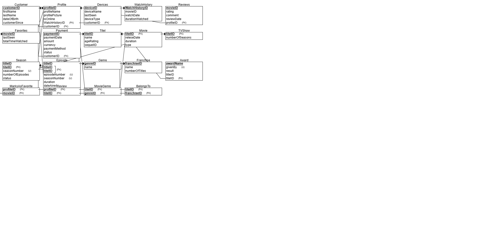

# 🎬 Netflix Database Management System 🗄️

A comprehensive PostgreSQL database system for managing a streaming service platform, built with Docker and featuring a graphical user interface. This project demonstrates advanced database concepts including ERD design, complex queries, stored procedures, and full-stack application development.

---

## 📋 Project Overview

This project implements a complete database management system for a Netflix-like streaming service, featuring:

- **Customer Management**: User profiles, devices, and subscription tracking
- **Content Management**: Movies, viewing history, favorites, and reviews  
- **Payment Processing**: Billing history and subscription management
- **Producer Integration**: Content creators, agents, contracts, and productions
- **Advanced Database Features**: Views, stored procedures, triggers, and constraints
- **GUI Application**: Python-based interface for database operations

---

## 🏗️ Database Architecture

### Entity-Relationship Diagram (ERD)


### Data Structure Diagram (DSD)


### Core Tables

#### 1. Customer Management
- **Customer**: Central entity storing customer information
- **Profile**: Multiple viewing profiles per customer account
- **Devices**: Customer viewing devices (TV, phone, tablet)

#### 2. Content & Interaction
- **WatchHistory**: Viewing history for recommendations
- **Favorites**: User's favorite content
- **Reviews**: User ratings and comments
- **MarksAsFavorite**: Junction table for profile-content relationships

#### 3. Financial
- **Payment**: Subscription payments and billing history

#### 4. Content Production (Integrated System)
- **Title**: Unified content entity (merged from Production table)
- **Creator**: Content creators and producers
- **Agent**: Talent representation
- **Contract**: Agreements and terms

---

## 🚀 Technical Implementation

### Phase 1: Database Design & Setup
- Designed normalized database schema
- Created ERD and DSD diagrams
- Set up PostgreSQL with Docker containers
- Implemented data persistence with Docker volumes

### Phase 2: Data Population & Queries
- Generated sample data using Python scripts and SQL
- Implemented complex SQL queries with JOINs, subqueries, and aggregations
- Created constraints for data integrity
- Implemented transaction management with rollback capabilities

### Phase 3: System Integration
- Performed reverse engineering of existing producer management system
- Integrated two database systems into unified schema
- Created database views for complex data analysis
- Merged Production table into Title entity

### Phase 4: Advanced Programming
- Developed stored procedures and functions
- Implemented database triggers for automated operations
- Created advanced business logic within the database

### Phase 5: GUI Development
- Built Python-based graphical interface
- Implemented CRUD operations through GUI
- Created user-friendly forms for database management

---

## 📊 Database Views & Queries

### Key Analytical Views

#### View 1: Customer Content Analytics


#### View 2: Production Management


### Sample Query Results

#### Viewing History Analysis (2024)


#### Payment Analytics (>200 NIS)


#### Device Management


#### Monthly Viewing Patterns


---

## 🔧 Data Management Operations

### Data Cleanup Operations

#### Inactive Profile Removal (1+ year)
**Before:** 
**After:** 

#### Device Cleanup (2+ years inactive)
**Before:** 
**After:** 

### Data Updates

#### Payment Status Updates
**Before:** 
**After:** 

#### Profile Picture Management
**Before:** 
**After:** 

---

## 🛡️ Data Integrity & Constraints

### Implemented Constraints
1. **Positive Payment Amounts**: Ensures all payments are non-negative
   

2. **Payment Status Validation**: Restricts payment status to predefined values
   

3. **Profile Picture Requirements**: Ensures all profiles have default pictures
   

### Transaction Management


---

## 🖥️ Graphical User Interface

### Application Screenshots

#### Login Interface


#### Customer Management


#### Add Customer Form


#### Edit Customer Interface


---

## 🔄 System Integration

### Integrated Architecture
The project successfully merged two independent systems:
1. **Original Streaming Platform**: Customer management, viewing history, payments
2. **Content Production System**: Creators, agents, contracts, productions

#### Final Integrated ERD


#### Final Integrated DSD


---

## 🛠️ Technologies Used

- **Database**: PostgreSQL
- **Containerization**: Docker & Docker Compose
- **Programming**: Python, SQL
- **GUI Framework**: Tkinter
- **Data Generation**: Python scripts with Faker library
- **Database Management**: pgAdmin

---

## 📁 Project Structure

```
├── code/sql/               # SQL scripts for table creation
├── part2/                  # Constraints and queries
├── part3/                  # Integration and views
├── part4/                  # Advanced programming (functions, procedures)
├── part5/                  # GUI application
├── images/                 # Documentation images
│   ├── erd/               # ERD and DSD diagrams
│   ├── queries/           # Query result screenshots
│   └── integrated/        # Integration diagrams
└── Backups/               # Data generation scripts
```

---

## 🎯 Key Achievements

- ✅ Designed and implemented normalized database schema
- ✅ Successfully integrated two independent database systems
- ✅ Created comprehensive data analysis views
- ✅ Implemented advanced database programming features
- ✅ Built user-friendly GUI for database operations
- ✅ Demonstrated data integrity through constraints and transactions
- ✅ Generated realistic sample data for testing

---

## 🚀 Running the Application

1. **Start Database**: Launch PostgreSQL and pgAdmin containers
2. **Initialize Schema**: Run SQL scripts to create tables and constraints
3. **Populate Data**: Execute data generation scripts
4. **Launch GUI**: Run `streaming_service_gui.py` for the interface

---

## 📚 Learning Outcomes

This project demonstrates proficiency in:
- Database design and normalization
- Complex SQL query development
- System integration and data migration
- Advanced database programming
- GUI application development
- Docker containerization
- Data analysis and visualization
