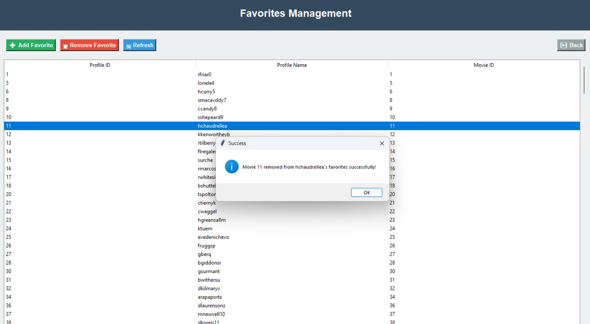

# 🧑‍💻 DB5785 - PostgreSQL and Docker Workshop 🗄️🐋

This workshop will guide you through setting up and managing a _PostgreSQL database_ using Docker.  
You will also explore how to use _pgAdmin_ GUI to interact with the database and perform various tasks.  

You will have to add to the [Workshop Files & Scripts](#workshop-id) section your own specific implementation  
- see: *[Markdown Guide](https://www.markdownguide.org)* and *[Writing and Formatting in Github](https://docs.github.com/en/get-started/writing-on-github/getting-started-with-writing-and-formatting-on-github)* for modifying this Readme.md file accordingly. 

---

## Prerequisites

Before you begin, ensure you have the following installed on your system:

- **Docker**: [Install Docker](https://docs.docker.com/get-docker/)
- **Docker Compose** (optional, but recommended): [Install Docker Compose](https://docs.docker.com/compose/install/)

---

## Setting Up PostgreSQL with Docker

### 1. **Pull the PostgreSQL Docker Image**
   Download the official PostgreSQL Docker image with the following command:

   ```bash
   docker pull postgres:latest
   ```

### 2. **Create a Docker Volume**
   Create a Docker volume to persist PostgreSQL data:

   ```bash
   docker volume create postgres_data
   ```

   This volume will ensure data persistence, even if the container is removed.

### 3. **Run the PostgreSQL Container**
   Start the PostgreSQL container using the following command:

   ```bash
   docker run --name postgres -e POSTGRES_PASSWORD=your_password -d -p 5432:5432 -v postgres_data:/var/lib/postgresql/data postgres
   ```

   Replace `your_password` with a secure password for the PostgreSQL superuser (`postgres`).

   - The `-v postgres_data:/var/lib/postgresql/data` flag mounts the `postgres_data` volume to the container's data directory, ensuring data persistence.

### 4. **Verify the Container**
   To confirm the container is running, use:

   ```bash
   docker ps
   ```

   You should see the `postgres` container listed.

---

## Setting Up pgAdmin with Docker

### 1. **Pull the pgAdmin Docker Image**
   Download the official PostgreSQL Docker image with the following command:

   ```bash
   docker pull dpage/pgadmin4:latest
   ```

### 2. **Run the pgAdmin Container**
   Start the pgAdmin container using the following command:

   ```bash
   docker run --name pgadmin -d -p 5050:80 -e PGADMIN_DEFAULT_EMAIL=admin@example.com -e PGADMIN_DEFAULT_PASSWORD=admin dpage/pgadmin4:latest
   ```

   Replace `5050` with your desired port, and `admin@example.com` and `admin` with your preferred email and password for pgAdmin.

   - The `-p 5050:80` flag maps port `5050` on your host machine to port `80` inside the container (where pgAdmin runs).

### 3. **Access pgAdmin**
   Open your browser and go to:

   ```
   http://localhost:5050
   ```

   Log in using the email and password you set.

---

## Accessing PostgreSQL via pgAdmin

finding Host address: 
  ```bash
  docker inspect --format='{{.NetworkSettings.IPAddress}}' postgres
  ```

### 1. **Connect to the PostgreSQL Database**
   - After logging into pgAdmin, click on **Add New Server**.
   - In the **General** tab, provide a name for your server (e.g., `PostgreSQL Docker`).
   - In the **Connection** tab, enter the following details:
     - **Host name/address**: `postgres` (or the name of your PostgreSQL container). [usually  172.17.0.2 on windows]
     - **Port**: `5432` (default PostgreSQL port).
     - **Maintenance database**: `postgres` (default database).
     - **Username**: `postgres` (default superuser).
     - **Password**: The password you set for the PostgreSQL container (e.g., `your_password`).
   - Click **Save** to connect.

### 2. **Explore and Manage the Database**
   - Once connected, you can:
     - Create and manage databases.
     - Run SQL queries using the **Query Tool**.
     - View and edit tables, views, and stored procedures.
     - Monitor database activity and performance.

---

## Workshop Outcomes

By the end of this workshop, you will:

- Understand how to set up PostgreSQL and pgAdmin using Docker.
- Learn how to use Docker volumes to persist database data.
- Gain hands-on experience with basic and advanced database operations.

----
<a name="workshop-id"></a>
## 📝 Workshop Files & Scripts (to be modified by the students) 🧑‍🎓 

This workshop introduces key database concepts and provides hands-on practice in a controlled, containerized environment using PostgreSQL within Docker.

### Key Concepts Covered:

1. **Entity-Relationship Diagram (ERD)**:
   - Designed an ERD to model relationships and entities for the database structure.
   - Focused on normalizing the database and ensuring scalability.

   **[Add ERD Snapshot Here]**

   images/erd/ERD.PNG
   > 

    images/erd/DSD.png
   > 
   
 images/erd/addimagetoreadme.PNG  
> 

images/erd/one.jpg
> 

  
   *(Upload or link to the ERD image or file)*

2. **Creating Tables**:
   - Translated the ERD into actual tables, defining columns, data types, primary keys, and foreign keys.
   - Utilized SQL commands for table creation.

### 1. Customer Table
**Purpose:** Central entity storing customer information for the streaming service platform.
**Attributes and their purposes:**

- `customerID (INT PRIMARY KEY)`: Unique identifier for each customer
- `firstName (VARCHAR)`: Customer's first name
- `lastName (VARCHAR)`: Customer's last name
- `dateOfBirth (DATE)`: For age verification and parental controls
- `customerSince (DATE)`: Account creation date for loyalty tracking

### 2. Devices Table
**Purpose:** Manages multiple viewing devices per customer (TV, phone, tablet, etc.).
**Attributes and their purposes:**

- `deviceID (INT PRIMARY KEY)`: Unique device identifier
- `deviceName (VARCHAR)`: Human-readable device name
- `deviceType (VARCHAR)`: Type of device (iOS, Android, Smart TV, etc.)
- `lastSeen (DATE)`: Last activity for security monitoring
- `customerID (INT, FOREIGN KEY)`: Links device to customer

### 3. WatchHistory Table
**Purpose:** Tracks viewing history for recommendations and analytics.
**Attributes and their purposes:**

- `WatchHistoryID (INT PRIMARY KEY)`: Unique record identifier
- `movieID (INT)`: Reference to content watched
- `watchDate (DATE)`: When content was viewed
- `durationWatched (FLOAT)`: Minutes watched for completion tracking

### 4. Favorites Table
**Purpose:** Stores user's favorite content for quick access.
**Attributes and their purposes:**

- `movieID (INT PRIMARY KEY)`: Unique content identifier
- `lastSeen (DATE)`: Last time marked as favorite
- `totalTimeWatched (FLOAT)`: Total viewing time for this content

### 5. Payment Table
**Purpose:** Manages subscription payments and billing history.
**Attributes and their purposes:**

- `paymentID (INT PRIMARY KEY)`: Unique payment identifier
- `paymentDate (DATE)`: When payment was processed
- `amount (FLOAT)`: Payment amount
- `currency (VARCHAR)`: Currency type (USD, EUR, etc.)
- `paymentMethod (VARCHAR)`: Payment method used
- `status (VARCHAR)`: Payment status (Completed, Pending, Failed)
- `customerID (INT, FOREIGN KEY)`: Links payment to customer

### 6. Profile Table
**Purpose:** Manages multiple viewing profiles per customer account (family members).
**Attributes and their purposes:**

- `profileID (INT PRIMARY KEY)`: Unique profile identifier
- `profileName (VARCHAR)`: Display name for profile
- `profilePicture (VARCHAR)`: Avatar image path
- `isOnline (BOOL)`: Current online status
- `WatchHistoryID (INT, FOREIGN KEY)`: Links to viewing history
- `customerID (INT, FOREIGN KEY)`: Links profile to customer

### 7. Reviews Table
**Purpose:** Stores user reviews and ratings for content.
**Attributes and their purposes:**

- `movieID (INT PRIMARY KEY)`: Content being reviewed
- `rating (INT)`: Star rating (1-5)
- `comment (VARCHAR)`: Written review text
- `reviewDate (DATE)`: When review was submitted
- `profileID (INT, FOREIGN KEY)`: Links review to profile

### 8. MarksAsFavorite Table
**Purpose:** Junction table linking profiles to their favorite content.
**Attributes and their purposes:**

- `profileID (INT, FOREIGN KEY)`: Profile marking favorite
- `movieID (INT, FOREIGN KEY)`: Content marked as favorite
- Composite primary key (profileID, movieID)


     code/sql/createtable.sql
   [Create_Table_Code](code/sql/createtable.sql)

3. **Generating Sample Data**:
   - Generated sample data to simulate real-world streaming scenarios using multiple methods.
   - Used Python scripts and SQL statements to automate bulk data insertion for large datasets.

   **[Add Sample Data Insert Script Here]**
   *(Upload or link to the sample data insert scripts)*

   
   Backups/Backup1/excelTemplateGen.py
   [Excel_Gen_Code](Backups/Backup1%20/excelTemplateGen.py)


   Backups/Backup1/generatedata.py
   [Generate_Data_Python_Code](Backups/Backup1%20/generatedata.py)

   Backups/Backup1/generatedata.sql
   [Generate_Data_SQL_Code](Backups/Backup1%20/generatedata.sql)

5. **Writing SQL Queries**:
   - Practiced writing **SELECT**, **JOIN**, **GROUP BY**, and **ORDER BY** queries.
   - Learned best practices for querying data efficiently, including indexing and optimization techniques.
  
     part2/Constraints.sql
     [Constraints](part2/Constraints.sql)

     part2/Queries.sql
     [Queries](part2/Queries.sql)

     part2/RollBackCommit
     [RollBack](part2/RollBackCommit)

   **[Add Example SQL Query Here]**
   *(Provide or link to example SQL queries)*

6. **Stored Procedures and Functions**:
   - Created reusable **stored procedures** and **functions** to handle common database tasks.
   - Used SQL to manage repetitive operations and improve performance.

   **[Add Stored Procedures/Function Code Here]**
   *(Upload or link to SQL code for stored procedures and functions)*

7. **Views**:
   - Created **views** to simplify complex queries and provide data abstraction.
   - Focused on security by limiting user access to certain columns or rows.

   **[Add View Code Here]**
   *(Provide or link to the SQL code for views)*

8. **PostgreSQL with Docker**:
   - Set up a Docker container to run **PostgreSQL**.
   - Configured database connections and managed data persistence within the containerized environment.

   **[Add Docker Configuration Code Here]**
   *(Link to or provide the Docker run command and any configuration files)*

---

## 💡 Workshop Outcomes

By the end of this workshop, you should be able to:

- Design and create a database schema based on an ERD.
- Perform CRUD (Create, Read, Update, Delete) operations with SQL.
- Write complex queries using joins, aggregations, and subqueries.
- Create and use stored functions and procedures for automation and performance.
- Work effectively with PostgreSQL inside a Docker container for development and testing.

---

## Additional Tasks for Students

### 1. **Database Backup and Restore**
   - Use `pg_dump` to back up your database and `pg_restore` or `psql` to restore it.

   ```bash
   # Backup the database
   pg_dump -U postgres -d your_database_name -f backup.sql

   # Restore the database
   psql -U postgres -d your_database_name -f backup.sql
   ```

### 2. **Indexing and Query Optimization**
   - Create indexes on frequently queried columns and analyze query performance.

   ```sql
   -- Create an index
   CREATE INDEX idx_your_column ON your_table(your_column);

   -- Analyze query performance
   EXPLAIN ANALYZE SELECT * FROM your_table WHERE your_column = 'value';
   ```

### 3. **User Roles and Permissions**
   - Create user roles and assign permissions to database objects.

   ```sql
   -- Create a user role
   CREATE ROLE read_only WITH LOGIN PASSWORD 'password';

   -- Grant read-only access to a table
   GRANT SELECT ON your_table TO read_only;
   ```

### 4. **Advanced SQL Queries**
   - Write advanced SQL queries using window functions, recursive queries, and CTEs.

   ```sql
   -- Example: Using a window function
   SELECT id, name, salary, ROW_NUMBER() OVER (ORDER BY salary DESC) AS rank
   FROM employees;
   ```

### 6. **Database Monitoring**
   - Use PostgreSQL's built-in tools to monitor database performance.

   ```sql
   -- View active queries
   SELECT * FROM pg_stat_activity;

   -- Analyze table statistics
   SELECT * FROM pg_stat_user_tables;
   ```

### 7. **Using Extensions**
   - Install and use PostgreSQL extensions like `pgcrypto` or `postgis`.

   ```sql
   -- Install the pgcrypto extension
   CREATE EXTENSION pgcrypto;

   -- Example: Encrypt data
   INSERT INTO users (username, password) VALUES ('alice', crypt('password', gen_salt('bf')));
   ```

### 8. **Automating Tasks with Cron Jobs**
   - Automate database maintenance tasks (e.g., backups) using cron jobs.

   ```bash
   # Example: Schedule a daily backup at 2 AM
   0 2 * * * pg_dump -U postgres -d your_database_name -f /backups/backup_$(date +\%F).sql
   ```

### 9. **Database Testing**
   - Write unit tests for your database using `pgTAP`.

   ```sql
   -- Example: Test if a table exists
   SELECT * FROM tap.plan(1);
   SELECT tap.has_table('public', 'your_table', 'Table should exist');
   SELECT * FROM tap.finish();
   ```

---

## Troubleshooting

### 1. **Connection Issues**
   - **Problem**: Unable to connect to the PostgreSQL or pgAdmin container.
   - **Solution**:  
     - Ensure both the PostgreSQL and pgAdmin containers are running. You can check their status by running:
       ```bash
       docker ps
       ```
     - Verify that you have the correct container names. If you are unsure of the names, you can list all containers (running and stopped) with:
       ```bash
       docker ps -a
       ```
     - Ensure that the correct ports are mapped (e.g., `5432:5432` for PostgreSQL and `5050:80` for pgAdmin).
     - Verify that the `postgres` container's name is used in pgAdmin's connection settings.
     - If using `localhost` and experiencing connection issues, try using the container name instead (e.g., `postgres`).
     - Check the logs for any error messages:
       ```bash
       docker logs postgres
       docker logs pgadmin
       ```
     - If you are still having trouble, try restarting the containers:
       ```bash
       docker restart postgres
       docker restart pgadmin
       ```

### 2. **Forgot Password**
   - **Problem**: You've forgotten the password for pgAdmin or PostgreSQL.
   - **Solution**:
     - For pgAdmin:
       1. Stop the pgAdmin container:
          ```bash
          docker stop pgadmin
          ```
       2. Restart the container with a new password:
          ```bash
          docker run --name pgadmin -d -p 5050:80 -e PGADMIN_DEFAULT_EMAIL=admin@example.com -e PGADMIN_DEFAULT_PASSWORD=new_password dpage/pgadmin4:latest
          ```
     - For PostgreSQL:
       1. If you've forgotten the `POSTGRES_PASSWORD` for PostgreSQL, you’ll need to reset it. First, stop the container:
          ```bash
          docker stop postgres
          ```
       2. Restart it with a new password:
          ```bash
          docker run --name postgres -e POSTGRES_PASSWORD=new_password -d -p 5432:5432 -v postgres_data:/var/lib/postgresql/data postgres
          ```

### 3. **Port Conflicts**
   - **Problem**: Port is already in use on the host machine (e.g., port 5432 or 5050).
   - **Solution**:  
     - If a port conflict occurs (for example, PostgreSQL's default port `5432` is already in use), you can map a different host port to the container's port by changing the `-p` flag:
       ```bash
       docker run --name postgres -e POSTGRES_PASSWORD=your_password -d -p 5433:5432 -v postgres_data:/var/lib/postgresql/data postgres
       ```
       This would map PostgreSQL’s internal `5432` to the host’s `5433` port.
     - Similarly, for pgAdmin, you can use a different port:
       ```bash
       docker run --name pgadmin -d -p 5051:80 -e PGADMIN_DEFAULT_EMAIL=admin@example.com -e PGADMIN_DEFAULT_PASSWORD=admin dpage/pgadmin4:latest
       ```

### 4. **Unable to Access pgAdmin in Browser**
   - **Problem**: You cannot access pgAdmin through `http://localhost:5050` (or other port you have set).
   - **Solution**:
     - Ensure the pgAdmin container is running:
       ```bash
       docker ps
       ```
     - Double-check that the port mapping is correct and no firewall is blocking the port.
     - If using a non-default port (e.g., `5051` instead of `5050`), ensure you access it by visiting `http://localhost:5051` instead.

### 5. **Data Persistence Issue**
   - **Problem**: After stopping or removing the PostgreSQL container, the data is lost.
   - **Solution**:
     - Ensure that you are using a Docker volume for data persistence. When starting the container, use the `-v` flag to map the volume:
       ```bash
       docker run --name postgres -e POSTGRES_PASSWORD=your_password -d -p 5432:5432 -v postgres_data:/var/lib/postgresql/data postgres
       ```
     - To inspect or back up the volume:
       ```bash
       docker volume inspect postgres_data
       ```

### 6. **Accessing pgAdmin with Docker Network**
   - **Problem**: If you are trying to connect from pgAdmin to PostgreSQL and the connection is unsuccessful.
   - **Solution**:
     - Make sure both containers (PostgreSQL and pgAdmin) are on the same Docker network:
       ```bash
       docker network create pg_network
       docker run --name postgres --network pg_network -e POSTGRES_PASSWORD=your_password -d -p 5432:5432 -v postgres_data:/var/lib/postgresql/data postgres
       docker run --name pgadmin --network pg_network -d -p 5050:80 -e PGADMIN_DEFAULT_EMAIL=admin@example.com -e PGADMIN_DEFAULT_PASSWORD=admin dpage/pgadmin4:latest
       ```
     - This ensures that both containers can communicate over the internal network created by Docker.

---

# Queries

### 1. **All profiles with viewing history in 2024, including the client's name**
   > 

### 2. **Average viewing time for favorite movies (Favorites)**
   > 

### 3. **Payment details of customers who paid over 200 NIS in the last year**
   > 

### 4. **Customers with more than two registered devices**
   > 

### 5. **List of profiles that added a favorite movie rated less than 3**
   > 

### 6. **All movies watched in October including how long they were watched**
   > 

### 7. **Details of customers who have not made any payments this year**
   > 

### 8. **Average viewing times by month**
   > 


---

# Deletions

### 1. **Deleting profiles inactive for over a year (based on viewing history)**
   #### Before:
   > 
   #### After:
   > 

### 2. **Deleting devices that have not been seen for over two years**
   #### Before:
   > 
   #### After:
   > 
   (In the Mockaroo we put only devices in range less then 2 year but we checked and it's work)

### 3. **Deleting failed payments**
   #### Before:
   > 
   #### After:
   > 

# Updates

### 1. **Updating an old payment status to "Completed"**
   #### Before:
   > 
   #### After:
   > 

### 2. **Update profile picture for users who don't have a picture**
   #### Before:
   > 
   #### After:
   > 

### 3. **Upgrading to 5 if the response is positive**
   #### Before:
   > 
   #### After:
   > 

# Rollback

   #### Mid Rollback:
   > 
   #### After Rollback:
   > 

# Constraints
### 1. **All anount of payment can not be negetive**
   > 

### 2. **Status of payment had to be from a specific list**
   > 

### 3. **Ensure every profile have a defult picture**
   > 


---


### שלב ג' - אינטגרציה ומבטים
בשלב זה ביצענו אינטגרציה של מערכת ניהול התוכן שלנו (אגף תוכן וסוגי מדיה) עם מערכת ניהול יוצרים והפקות. התהליך כלל הנדוס לאחור, יצירת מודל נתונים משולב, שינוי סכמת בסיס הנתונים הקיים והגדרת מבטים (Views) לניתוח הנתונים המאוחדים.

### הנדוס לאחור: המערכת הנוספת
קיבלנו גיבוי של בסיס נתונים של אגף ניהול יוצרים, סוכנים, חוזים והפקות. ביצענו הנדוס לאחור כדי להבין את מבנה הנתונים שלו.

### תרשים DSD של המערכת הנוספת
> 
### תרשים ERD של המערכת הנוספת
> 

### תהליך האינטגרציה
תהליך האינטגרציה התמקד במיזוג טבלת Production ממערכת היוצרים לתוך טבלת Title הקיימת במערכת שלנו, כדי ליצור ישות מרכזית ואחידה לכלל התכנים.


#### Integrated ERD
> 

#### Integrated DSD
> 


### The database is populated correctly 
> 

#### Alter Table
-The alter table works as you could see in the picture below:
> 

#### View 1
> 

#### Query 1.1
> 

### Query 1.2
> 

#### View 2
> 

#### Query 2.1
> 


#### Query 2.2
> 

---


### שלב ד' - תכנות בסיס נתונים מתקדם
בשלב זה פיתחנו תוכניות מתקדמות בסיס נתונים הכוללות פונקציות, פרוצדורות, טריגרים ותוכניות ראשיות. התוכניות מממשות פונקציונליות מגוונת לניהול ובקרת נתונים במערכת Netflix המשולבת.

### פונקציות (Functions)
> 


---
### שלב ה' - יצירת ממשק גרפי לעבודה מול בסיס הנתונים  

בשלב הזה נכתוב ממשק גרפי עבור האפליקציה.
### Login:
> 

### Customers:
> 

### Add Customer:
> 

### Delete:
> 

### Edit Customer:
> 

אפשר לצפות בשאר הקבצים והדברים בהרצה של קובץ הפייתון שיצרנו: "streaming_service_gui.py"


---
## 👇 Resources

- [PostgreSQL Documentation](https://www.postgresql.org/docs/)
- [pgAdmin Documentation](https://www.pgadmin.org/docs/)
- [Docker Documentation](https://docs.docker.com/)

